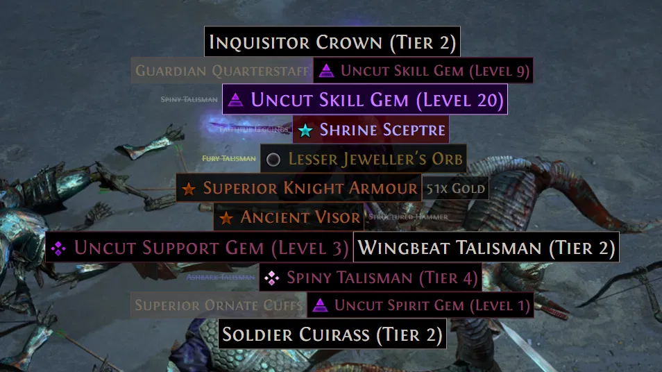
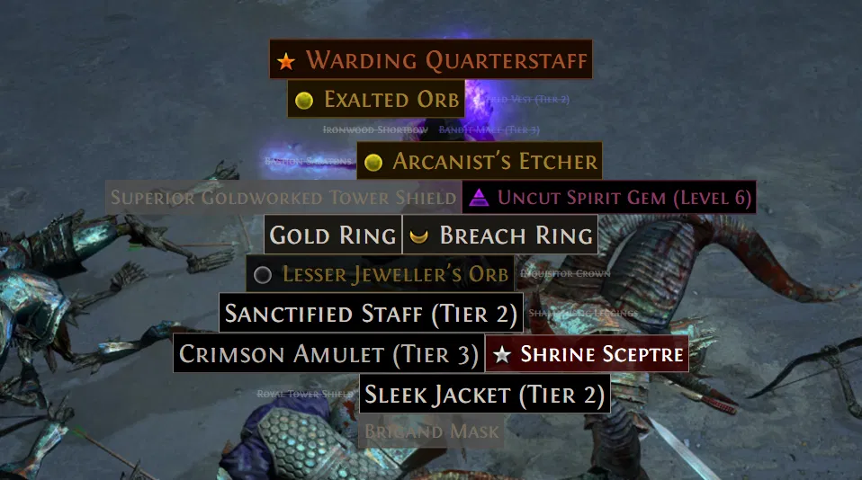
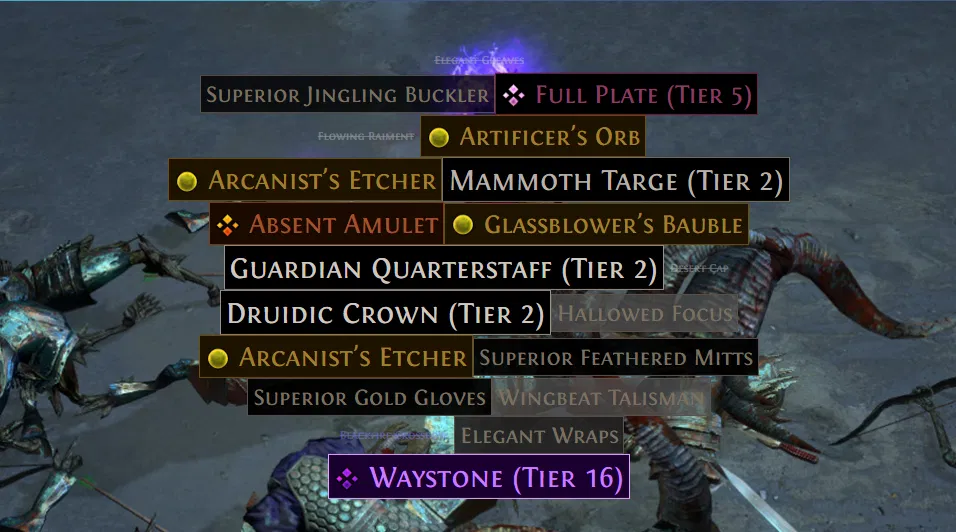

# Dark Moody Amethyst — PoE2 FilterBlade Theme

A custom color theme for NeverSink's Semi-Strict filter on [FilterBlade.xyz](https://www.filterblade.xyz/?game=Poe2). Built around a dark, moody palette anchored by amethyst purple for top-tier drops, with a consistent visual language across all item categories.

---

## Screenshots

### Gems, Currency & Uniques


Clear visual hierarchy at a glance — purple triangle for skill gems, purple kite for spirit gems, purple diamond for support gems, yellow circle for currency, orange star for uniques. Filler gear fades into the background.

### Jewellery & Currency


Silver moon icons for jewellery stand out immediately from currency (yellow circle) and uniques (orange star). The purple beam signals a high-value drop worth stopping for.

### Waystones & Currency


T16 waystone in full amethyst purple with diamond icon. Currency in dark gold circles. Low-value gear fades naturally. The visual hierarchy lets you prioritize without reading every label.

---

## Color System

The scheme uses color to communicate item category and tier simultaneously.

| Color | Items |
|---|---|
| 🟣 Amethyst Purple | S-tier apex, T16 waystones, top fragments, splinters, gems |
| 🟡 Dark Gold | Currency T1–T2, gigantic gold piles, top fragments |
| 🟠 Sienna Orange | Uniques, exotics B-tier, high waystones T13–T15 |
| 🩷 Crimson Rose | Rare jewels, exotics C-tier |
| 🔵 Steel Blue | Magic jewels, exotics D-tier, lower waystones |
| 🔴 Blood Red | Artifacts, corrupted exotics, xeno A-tier |
| 🟢 Forest Green | Flasks, charms, xeno B–C, crafting bases |
| ⬜ Silver | Jewellery (T1 bright, T2 dimmer) |
| 🩶 Ash Grey | Salvageables, filler, low-value drops |

---

## Icon Language

Each item type uses a distinct icon shape so you know what dropped before reading the label.

| Shape | Item Type |
|---|---|
| ★ Star | S-tier apex, uniques, top fragments |
| ● Circle | Currency, gold piles |
| ◆ Diamond | Support gems, exotics, crafting bases, lineage gems |
| ▲ Triangle | Skill gems |
| Kite | Spirit gems |
| ■ Square | Waystones |
| ☽ Moon | Jewellery (looks like a ring) |
| ✦ Cross | Charms |
| ⌂ UpsideDownHouse | ilvl 82 crafting bases |

---

## Sound Language

| Sound | Items |
|---|---|
| Stefan Gold — Very Valuable | Apex, top currency, top fragments |
| Stefan Gold — Maybe Valuable | Uniques, exotics B-tier, chancing bases |
| Stefan Gold — Currency | High gold piles |
| Zizaran — Currency | Gigantic/large gold piles |
| GhazzyTV — High Maps | Pinnacle keys, high fragments |
| GhazzyTV — Maps | Mid fragments |
| `shake.mp3` | Support gems, lineage gems (stop everything) |
| `gem.mp3` | Skill and spirit gems |
| `jewel.mp3` | Jewels |
| `hit.mp3` | Corrupted exotics (danger signal) |
| `chime1.mp3` | Mid currency, exotics C |
| `chime2.mp3` | Flasks and charms |
| `pong.mp3` | Xeno items |
| `map1/2/3.mp3` | Waystones by tier |
| Normal sound 6 | Jewellery |
| Lolcohol — Chancing | ilvl 82 crafting bases |

---

## Files

| File | Purpose |
|---|---|
| `dark-moody-amethyst-colors.md` | Full technical reference — all style keys, colors, sounds, icons, beams, re-apply scripts |
| `dark-moody-amethyst-MANUAL.md` | Manual application guide — step-by-step for every rule in FilterBlade UI |
| `fix_savefile.py` | Fix script — run on every downloaded save file before reloading into FilterBlade |
| `CLAUDE.md` | Claude Code notes — FilterBlade API, automation scripts, architecture |

---

## Applying the Theme

### Manual
Follow `dark-moody-amethyst-MANUAL.md` — it covers every rule in order with all properties (label size, text, border, background, icon, beam, sound) in one place per rule.

### Automated (browser console)
Open FilterBlade, paste the scripts from Sections 5, 6, 8, and 9 of `dark-moody-amethyst-colors.md` into the browser console to apply all colors, sounds, icons, and beams programmatically.

### Save File Fix
Every time you download a save file and want to reload it:

```bash
python3 fix_savefile.py YourFilter.filterBladeSaveFile
# Creates YourFilter_fixed.filterBladeSaveFile — load this into FilterBlade
```

FilterBlade crashes on load if the save file contains `null`/`false` values or hex color strings. The fix script normalizes these automatically.

---

## Customize Tab — Manual Steps Required

Some FilterBlade settings cannot be applied via style keys or console scripts and must be set manually in the Customize tab:

- **Gem icons** — Skill/spirit/support share the same style keys so icon shape must be set per rule. See the Customize tab section in `dark-moody-amethyst-MANUAL.md`.
- **Waystone colors** — Waystones don't connect to style keys. Colors must be set directly on each T1–T16 rule in Customize → Waystones → Normal.
- **Lineage gem A/B/C colors** — These use unique style keys (`uniques/a`, `uniques/x`, `uniques/b`). Override colors directly on each rule in Customize → Lineage Gems.
- **Campaign highlight rules** — Custom show/hide rules for campaign item types (weapons, armour, jewellery, belts, charms). Set per category with the weapon/armour/jewellery/charm color groupings.
